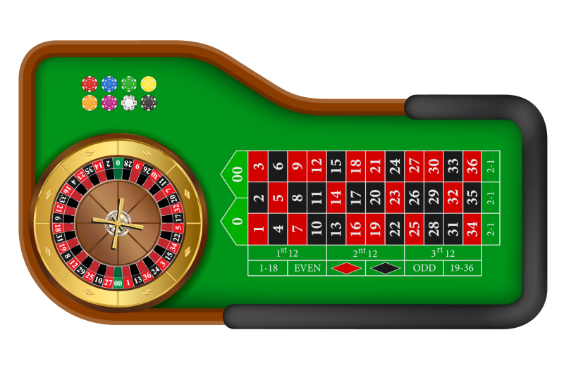
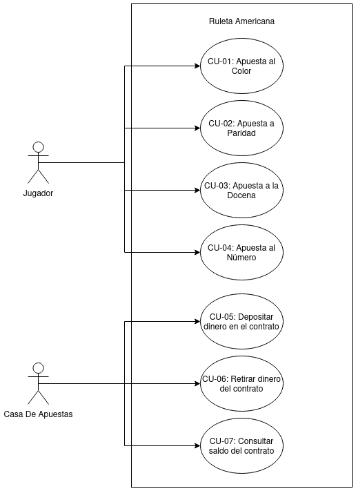
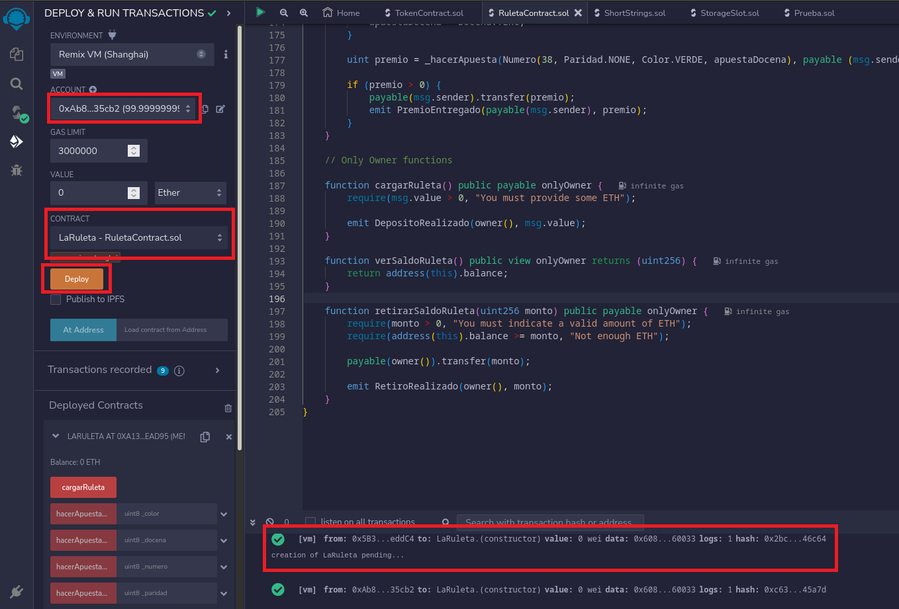
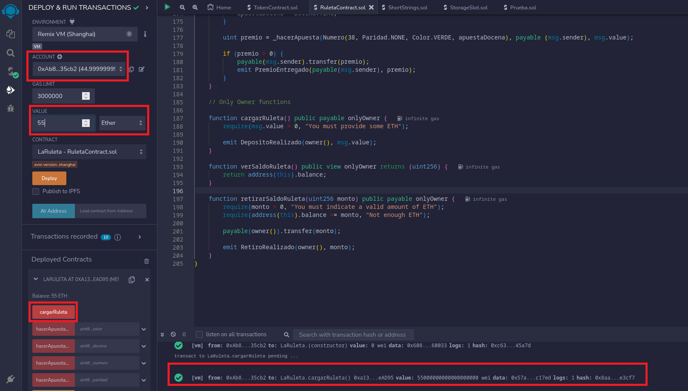
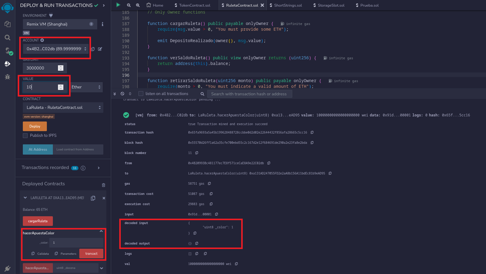
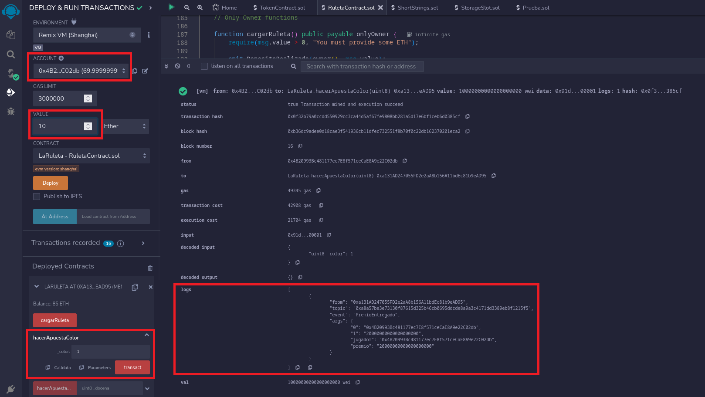

La Ruleta Americana _Smart Contract_
===

Definición
---

El contrato descrito a continuación se basa en una implementación simplificada de la ruleta americana.



La ruleta tiene un funcionamiento bastante intuitivo. El _crupier_ de la casa de apuestas lanza una pequeña bola que gira alrededor de la ruleta hasta caer en uno de los números. Estos, a mayores, están marcados con tres colores: rojo, negro y verde. 

El objetivo del jugador es apostar al número que saldrá como ganador o, en su defecto, a alguna característica del resultado premiado (en nuestra implementación: color, paridad o docena). En caso de acertar, el premio variará en función del concepto y la cantidad apostada, aplicando diferentes tarifas siguiendo esta relación:

+ Apuesta a Paridad o Color: Dinero apostado x2.
+ Apuesta a Docena: Dinero apostado x3.
+ Apuesta a Número: Dinero apostado x36.

Recalcar que no han sido implementadas todas las estrategias existentes de apuesta.

Una de las grandes diferencias frente a la ruleta "real" es que varios jugadores pueden apostar en una misma tirada. En este caso, el jugador dispone de un único intento por ronda. 

La gran ventaja frente a otras ruletas implementadas por casas de apuestas online es la fiabilidad que asegura este tipo de pago, ya que se puede revisar el código fuente y comprobar que se implementa de una forma justa. Además, siempre se asegura que ambas partes reciben el pago sin necesidad de intermediario.

Diseño del contrato
---

### Actores y casos de uso

Para este contrato se han definido los siguientes actores:

- Jugador: Todo aquel usuario que interactúa con el sistema realizando una apuesta. 
- Casa de Apuestas: Es el propietario del contrato. Gestiona el crédito de la ruleta.

A continuación se describen los casos de uso:

+ CU-01: Apuesta al Color.

  Actor: Jugador.

  Funcionamiento: El usuario selecciona una cantidad a apostar y el color, que vendrá determinado por el valor 0 (Rojo) o 1 (Negro).

  Prerrequisitos: La cantidad indicada debe ser mayor a 0.

+ CU-02: Apuesta a Paridad.

  Actor: Jugador.

  Funcionamiento: El usuario selecciona una cantidad a apostar y la paridad, que vendrá determinado por el valor 0 (Par) o 1 (Impar).
    
  Prerrequisitos: La cantidad indicada debe ser mayor a 0 y el valor de la apuesta introucido debe ser válido.

+ CU-03: Apuesta a la Docena.

  Actor: Jugador.

  Funcionamiento: El usuario selecciona una cantidad a apostar y la docena, que vendrá determinado por el valor 0 (Primera docena), 1 (Segunda docena) o 2 (Tercera Docena).

  Prerrequisitos: La cantidad indicada debe ser mayor a 0 y el valor de la apuesta introucido debe ser válido.

+ CU-04: Apuesta al Número.

  Actor: Jugador.

  Funcionamiento: El usuario selecciona una cantidad a apostar y el número, que vendrá determinado por un entero entre los valores 0 y 37. Debe tenerse en cuenta que el valor 37 se corresponde con el 00 de la ruleta americana.

  Prerrequisitos: La cantidad indicada debe ser mayor a 0 y el valor de la apuesta introucido debe ser válido.
    
+ CU-05: Depositar dinero en el contrato.

  Actor: Casa de Apuestas.

  Funcionamiento: El usuario selecciona una cantidad que será depositada en el monto total del contrato y retirada de su cuenta.
  
  Prerrequisitos: La cantidad indicada debe ser mayor a 0.

+ CU-06: Retirar dinero del contrato.

  Actor: Casa de Apuestas.

  Funcionamiento: El usuario selecciona una cantidad que será retirada del monto total del contrato e ingresada en su cuenta.
  
  Prerrequisitos: La cantidad indicada debe ser mayor a 0 e inferior al monto total del contrato.

+ CU-07: Consultar saldo del contrato.

  Actor: Casa de Apuestas.

  Funcionamiento: El usuario realiza una llamada sobre el contrato para consultar el saldo disponible en el mismo.


###### Diagrama de casos de uso


### Estructura de datos

Se emplearon las siguientes estructuras de datos:

+ Número: Se emplea para definir la situación de un número en la ruleta.

```
struct Numero {
  	    uint8 numero;
        Paridad paridad;
        Color color;
        Docena docena;
    }
```

+ Apuesta: Se emplea para definir las características concretas de una apuesta por parte del jugador.

```
struct Apuesta {
        address payable jugador;
        Numero numero;
        uint cantidad;
    }
```

### Funciones implementadas:

```
function hacerApuestaColor(uint8 _color) public payable
```

Esta función implementa el caso de uso **CU-01: Apuesta al Color**. Permite apostar a un color.

```
function hacerApuestaParidad(uint8 _paridad) public payable
```

Esta función implementa el caso de uso **CU-02: Apuesta a Paridad**. Permite apostar a la paridad.

```
function hacerApuestaDocena(uint8 _docena) public payable
```

Esta función implementa el caso de uso **CU-03: Apuesta a la Docena**. Permite apostar a la docena.

```
function hacerApuestaNumero(uint8 _numero) public payable 
```

Esta función implementa el caso de uso **CU-04: Apuesta al Número**. Permite apostar al número.


```
function cargarRuleta() public payable onlyOwner 
```

Esta función implementa el caso de uso **CU-05: Depositar dinero en el contrato**. Permite depositar saldo en el contrato.

```
function retirarSaldoRuleta(uint256 monto) public payable onlyOwner
```

Esta función implementa el caso de uso **CU-06: Retirar dinero del contrato**. Permite retirar saldo del contrato.


```
function verSaldoRuleta() public view onlyOwner returns (uint256)
```

Esta función implementa el caso de uso **CU-07: Consultar saldo del contrato**. Permite consultar el saldo del contrato.

### Constructor

```
constructor() Ownable(msg.sender)
```

Esta función inicializa la ruleta creando un array de números (estructura descrita anteriormente) con las características correspondientes de cada elemento y almacenandola en el contrato. 

Este contrato hereda de Ownable para que solo el propietario del mismo (en este caso la casa de apuestas) pueda añadir o retirar así como consultar el saldo de la ruleta.

Pruebas de Aceptación
---

Se han realizado una serie de pruebas de aceptación para comprobar el correcto funcionamiento de los casos de uso descritos previamente desde el punto de vista del cliente. 

Algunas de las pruebas realizadas han sido las siguientes:

### Pasos previos

Para las pruebas descritas a continuación se empleó Remix y sus _evm_ para el despliegue del contrato. Dicho despliegue está asociado a una cuenta de las que la herramienta nos proporciona, la cual será la propietaria y podrá aumentar o disminuir el saldo del mismo.


###### Captura del despliegue en Remix. Recuadrados la cuenta propietaria, el contrato seleccionado, el botón de _deploy_ y los logs correspondientes al desplegue.

Aunque la implementación nos permite realizar apuestas a pesar de ser los propietarios, lo ideal es escoger otra cuenta de las disponibles en el desplegable correspondiente a la hora de jugar una ronda.

### Prueba de aceptación CU-05

El primer caso de uso a probar debe ser depositar crédito en el contrato, ya que en caso de que un jugador realizase la primera apuesta y ganase la misma, el sistema no podría devolver el premio.

Para probar el correcto funcionamiento de este caso de uso, se escogerá la cuenta con la que se desplegó el contrato y se probarán a introducir valores dentro del saldo disponible de la misma. 


###### Captura de carga de saldo exitosa sobre el contrato. Recuadrados la cuenta propietaria (igual a la de la captura previa), el valor asociado a la transacción, el botón de ejecución del caso de uso y el log resultante de la operación.  

A continuación debe realizarse la misma comprobación con otra cuenta, que no sea la propietaria, y verificar que no permite completar la transacción.

El procedimiento seguido con esta transacción es el mismo aplicado para los casos de uso CU-06 y CU-07, adaptados a su funcionamiento.

### Prueba de aceptación CU-01

Para probar este caso de uso se seleccionó una cuenta diferente a la del propietario y se realizaron una serie de apuestas a las diferentes posibilidades, en este caso Rojo y Negro. 


###### Captura de apuesta realizada al rojo perdedora. Recuadrados la cuenta desde la que se realizó la apuesta, el importe de la transacción, el botón y el input para realizar la apuesta y la salida del log.

En caso de que el usuario obtenga un premio, se realizará un emit con su dirección y la cantidad ganada.


###### Captura de apuesta realizada al rojo ganadora. Recuadrados la cuenta, el importe, el botón y el input para llevar a cabo la transacción y el evento con la dirección y el importe.

El procedimiento seguido con esta transacción es el mismo aplicado para los casos de uso CU-02, CU-03 y CU-04, adaptados a su funcionamiento.

Autores: Sergio Álvarez Varela y Miguel Oliveira Carballo. 